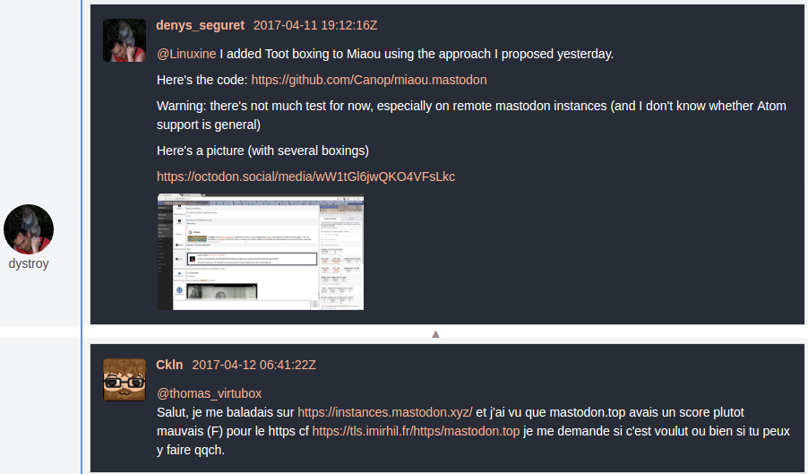

# miaou.mastodon
Mastodon boxing for Miaou

## What it does

A toot URL in a Miaou message is replaced with a rendering of that toot:

## How it works

When the Miaou boxer sees a message containing what looks like a toot URL, it sends a HEAD request to that URL.

If a `link` header of type `application/atom+xml` can be found in the answer, that new URI is requested.

The resulting XML is rendered in HTML and this HTML is sent to all browsers rendering the Miaou message.
